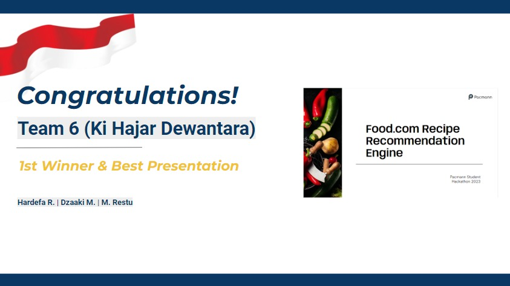

# Food.com Recipe Recommendation Engine

A practical solution for personalized recipe recommendations, leveraging machine learning to predict user preferences, using Food.com dataset.

## Table of Contents

1. [Project Description](#project-description)
2. [Project Architecture](#project-architecture)
3. [Installation Guide](#installation-guide)
4. [Dataset Information](#dataset-information)
5. [Conclusions](#conclusions)
6. [Future Works](#future-works)
7. [References](#references)

## Project Description

In the online food and recipe platforms, maintaining user engagement is an important challenge. Recommending recipes that align with users' preferences, health needs, and dietary restrictions can play a critical role in keeping the user engaged and coming back to the platform. Our project proposes an innovative solution that leverages machine learning to enhance user engagement through personalized recipe recommendations.

Our engine uses a collaborative filtering approach, focusing on ratings given by the user on previously rated recipes to make these recommendations. This way, we can more accurately predict what recipes the user may like or find useful in the future. The key performance metrics for our machine learning model are the Root Mean Square Error (RMSE) and Mean Absolute Error (MAE), which measure how well the model is performing in making accurate recommendations.

## Project Architecture

The project's architecture has a structured folder layout for better organization and accessibility. The root directory consists of several sub-folders each dedicated for specific purposes. The project's folder structure would look like this:

```bash
.
├── data
│   ├── processed
│   └── raw
├── models
├── notebooks
│   ├── 1_data_preparation
│   ├── 2_exploratory_data_analysis_and_preprocessing
│   ├── 3_feature_engineering
│   └── 4_model_training_and_evaluation
├── references
├── reports
│   └── figures
└── src
    ├── back_end
    └── front_end
```

## Installation Guide

This project utilizes Docker to manage the service environment. Here's a step-by-step guide to build the Docker image, create the Docker container, and run the service:

### Build The Docker Image

Open your terminal in the project root directory, and run the following command to build the Docker image:

```bash
docker-compose build
```

### Create The Docker Container

Now, let's create a Docker container from the image we just built. Run the following command:

```bash
docker-compose up
```

Upon successfully creating the Docker container, your service should automatically be up and running. You can access it through the localhost port on your web browser via this [URL](http://localhost:8501/):

```bash
http://localhost:8501/
```

If you want to stop the service for any reason, you can press <kbd>CTRL</kbd> + <kbd>C</kbd> in your current terminal or use the following command in another terminal:

```bash
docker-compose down
```

### Run the Service

To start the service, use the following command in your terminal:

```bash
docker-compose up
```

You can now access the front-end of the service through the localhost port on your web browser via this [URL](http://localhost:8501/):

```bash
http://localhost:8501/
```

To use the service, simply choose a User ID from the drop-down menu and click the 'Submit' button. The engine will then display recipes that the selected user has previously rated, along with new recipe recommendations for the user to rate next.

### API Details

#### Fetching Available User IDs

To get a list of available user IDs for making recommendations, send a GET request to the following endpoint:

```bash
http://backend:8000/available_users
```

#### API Response Format

The API will respond with a list of available user IDs in the following JSON format:

```json
{
  "user_ids": [1, 2, 3, ...]
}
```

#### Fetching Recipe Recommendations for a User

To get past rated recipes and new recipe recommendations for a specific user, send a GET request to this endpoint:

```bash
http://backend:8000/recommend/{user_id}
```

Replace <kbd>{user_id}</kbd> with the actual user ID you are interested in.

#### API Response Format

The API will respond with the user's past rated recipes and new recipe recommendations in the following format:

```json
{
  "past_rated_recipes": ["Recipe 1", "Recipe 2", ...],
  "recommended_recipes": ["Recipe A", "Recipe B", ...]
}
```

Simply use Postman to send these GET requests to the mentioned endpoints and you will receive the data in the mentioned formats.

## Dataset Information

The dataset leveraged for this project comes from Food.com (formerly GeniusKitchen). This extensive dataset contains over 180K recipes and 700K recipe reviews, spanning 18 years of user interactions and uploads.

Key files used in our project from this dataset include:

- `RAW_interactions.csv`: Contains user interactions, including recipe reviews and ratings.
- `RAW_recipes.csv`: Contains details of the recipes.

For more in-depth information, a detailed document describing the dataset is available [here](references/DATASET.md).

## Conclusions

- Due to computational limitations, the dataset was narrowed to include only the last 3 years of data.
- Both SVD and KNN algorithms were explored. KNN was ultimately selected for its superior performance in RMSE metrics.
- No hyperparameter tuning was carried out to optimize the models further.
- The feature used for making recommendations was the explicit data—user ratings. A user-item matrix was developed for this purpose.
- A front-end was created specifically for administrators, displaying past rated and recommended recipes for each registered user.
- Both front-end and back-end services were containerized using Docker, enhancing maintainability.
- While the project has not been deployed yet, the recommendation engine has the potential to significantly improve user engagement and increase key metrics like User Retention and Repeat Visitor Rate.

## Future Works

- Expand the dataset to include a broader timeframe, improving the model's comprehensiveness.
- Incorporate more personalized features, potentially leveraging implicit data for more accurate recommendations.
- Investigate the use of advanced modeling techniques to improve the system's recommendation capabilities.
- Improve the user interface to allow users to directly view personalized recommendations on their account pages.
- Enhance the administrator UI for a more intuitive understanding of user recommendations.
- Optimize Docker setup for resource efficiency and quicker startup times.

## Medium Articles

[Recipe for Retention: How a Data-Driven Recommendation Engine is Spicing Up User Engagement for Food.com](https://medium.com/@hardefarogonondo/recipe-for-retention-how-a-data-driven-recommendation-engine-is-spicing-up-user-engagement-for-518fe347a3dd)

## Acknowledgment: Pacmann Student Hackathon 2023

This project was developed as part of the Pacmann Student Hackathon 2023, a competitive and enriching event that brought together talented data scientists and developers.

We're absolutely thrilled to announce that our project not only received the "Best Presentation Award" but also secured the 1st Place in the Pacmann Student Hackathon 2023. This accolade is a testament to the hard work, dedication, and skill of our incredible team.

We'd like to express our deepest gratitude to the hackathon organizers, judges, and fellow participants. It was an enriching experience to compete against such talented individuals, and we learned a lot along the journey.

Thank you for making this event a challenging yet rewarding experience!



## References

This section lists all the references and resources utilized during the project.

[1] [Generating Personalized Recipes from Historical User Preferences](https://aclanthology.org/D19-1613/)

[2] [ML-Based Collaborative Filtering for Cross-Cultural Music Recommendations](https://cs229.stanford.edu/proj2021spr/report2/82006572.pdf)

[3] [FastAPI](https://fastapi.tiangolo.com/)

[4] [Streamlit](https://streamlit.io/)

[5] [Docker](https://www.docker.com/)
